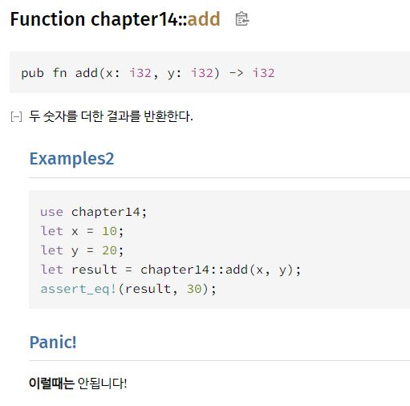
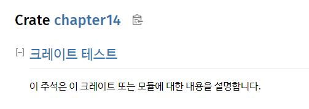
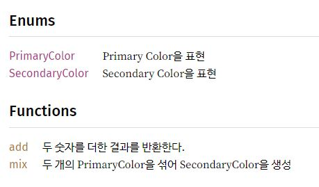
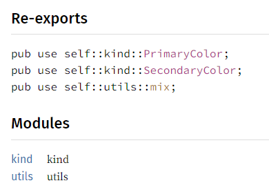

# Cargo & crates.io
필요할 때 공식문서 보기

## 릴리즈 프로필
옵션 [공식 문서](https://doc.rust-lang.org/cargo/reference/profiles.html)

- dev: 개발 환경 설정
- release: 릴리즈 환경 설정
```toml
[profile.dev]
opt-level = 0


[profile.dev]
opt-level = 3
```
- opt-level: 최적화 레벨. 0 ~ 3 단계 존재. 높을 수록 최적화 잘됨
## crates.io 배포
배포와 관련된 사항은 당장 필요하지 않으므로 나중에 필요할 때 참고

[공식 문서](https://doc.rust-kr.org/ch14-02-publishing-to-crates-io.html)

## 문서화 주석
문서화 주석은 달아 둔 주석을 기반으로 HTML 문서를 생성할 수 있는 특별한 주석이다. 주석을 기반으로 현재 프로젝트에 대한 API 문서를 자동으로 만들어준다고 보면 된다.

rust 공식 규격이 있는 swagger 같은 느낌?

문서화 주석의 종류는 2가지로, (1) 모듈 내 아이템을 설명하기 위한 주석과, (2) 모듈 또는 크레이트 자체를 설명하는 주석이 있다.

1. ```///```: 모듈 내 아이템(함수, 구조체, 메서드 등)을 설명하는 주석
2. ```//!```: 모듈 또는 크레이트 자체를 설명하는 주석

문서화 주석에 대해 알고 있어야 할 사항을 간단하게 정리
- ```cargo doc --open```: 현재 크레이트 + 의존성 관련 문서 생성 + 웹 브라우저 오픈
- 마크다운의 문법을 채용하고 있다.
- code 영역(트리플 백틱 = \`\`\`)에 작성된 코드는 **테스트 시 평가**된다.
- \# 기호를 이용하여 제목을 지정할 수 있다. 자주 사용되는 것은 다음과 같다.
    - ```# Examples```: 코드 사용 예시를 표현
    - ```# Panics```: panic!이 발생 가능한 시나리오를 표현
    - ```# Errors```: Result를 반환하는 경우 발생 가능한 에러 종류 + 조건을 명시
    - ```# Safety ```: 함수가 ```unsafe```하다면 함수가 안전하지 않은 이유, 호출 시 지켜야 할 불변성을 설명
## \\\\\\ 주석
```rust
/// 두 숫자를 더한 결과를 반환한다.
/// # Examples2
/// ```
/// use chapter14;
/// let x = 10;
/// let y = 20;
/// let result = chapter14::add(x, y);
/// assert_eq!(result, 30);
/// ```
/// # Panic!
/// **이럴때는** 안됩니다!
pub fn add(x: i32, y: i32) -> i32 {
  x + y
}
```



위와 같이 트리플 백틱(\`\`\`)을 사용하면 코드 영역을 만들 수 있다. 이 영역에 정의된 코드는 테스트 대상이 된다. 주석 내 코드에서 통합 테스트처럼 현재 코드가 패키지 외부에 있다고 가정하고 각 모듈을 ```use```를 이용하여 로드한다.

## \\\\!주석

```rust
//! # 크레이트 테스트
//! 이 주석은 이 크레이트 또는 모듈에 대한 내용을 설명합니다.
```
```//!``` 주석은 모듈 / 크레이트 자체를 설명하기 위한 주석으로, HTML 상에서 다음과 같이 표현된다.



## pub use로 공개
```rust
mod kind;
mod utils;

pub use self::kind::*;
pub use self::utils::*;
```
라이브러리 루트 크레이트에 해당하는 src/lib.rs 파일에 위와 같이 선언한다. 사용자가 사용하기 쉽게, 모듈 자체를 공개하는 대신 use를 통해 아이템을 크레이트 루트 스코프로 모아 공개한다,



모듈을 공개하면 pub use로 공개한 아이템이 ```Re-exports```에 표현된다.
```rust
pub mod kind;
pub mod utils;

pub use self::kind::PrimaryColor;
pub use self::kind::SecondaryColor;
pub use self::utils::mix;
```
