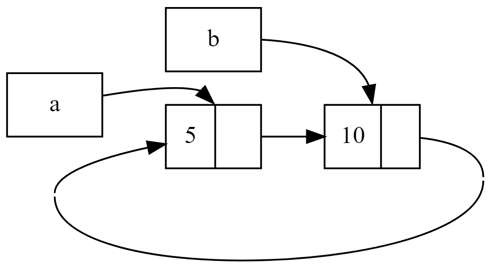

# 스마트 포인터
포인터처럼 작동 + 메타데이터를 기반으로 추가적인 능력을 가진 포인터.

C++의 shared_ptr, unique_ptr 등 다른 언어에도 존재하는 개념

참조자와는 달리, 스마트 포인터는 보통 데이터를 소유하고 있다. 러스트 공식문서 에서는 `Vec<T>`, `String` 같은 타입도 메모리를 소유하고 다룰 수 있게 해준다는 측면에서 스마트 포인터의 일종이라고 설명한다.

일반적으로 구조체를 기반으로 구현되며, 몇몇 trait을 구현한다.
- `Deref`: 인스턴스가 참조자처럼 동작하도록 만들어, 참조자·스마트 포인터와 함께 작동하는 코드를 작성할 수 있게 한다.
- `Drop`: 스마트 포인터 인스턴스가 스코프 바깥으로 벗어날 때 실행되는 코드를 커스터마이징할 수 있게 한다.

자주 사용하는 스마트 포인터 종류들...
- `Box<T>`: 값을 힙에 할당
- `RC<T>`: 복수 소유권을 가능하게. 참조 **카운팅**
- `Ref<T>`, `RefMut<T>`:  대여 규칙을 런타임에 강제, `RefCell<T>`로 접근 가능

# Box&lt;T&gt;
힙에 데이터를 저장할 수 있게 만들어주는 스마트 포인터.

힙에 데이터를 담는 것 이외의 특별한 기능이 없어 성능적 오버헤드가 없다.

1. 컴파일 타임에 크기를 알 수 없는 타입을 정확한 크기를 요구하는 컨텍스트 내에서 사용하고 싶음 => Box 기반 재귀적 타입
2. 커다란 데이터의 소유권을 옮길 때 데이터가 복사되지 않음을 보장하고 싶음 => 실제 데이터는 힙에 존재, 힙을 가리키는 포인터 데이터만 스택에서 복사
3. 특정 트레잇을 구현했다는 사실만 알고 값을 사용하고 싶음 => 트레잇 객체

```rust
let b = Box::new(5);
println!("b = {b}");
```
`Box::new`의 파라미터에 힙에 저장하고 싶은 데이터를 담아 생성. 박스가 스코프를 벗어나면, 연관된 힙 상의 데이터도 함께 해제됨.

## 재귀적 타입
자신 안에 자신과 동일한 타입의 값을 담을 수 있는 타입. 

linked list의 각 노드를 일종의 재귀적 타입으로 볼 수 있다.

```rust
// Cons는 재귀적인 배리언트. 컴파일 타임에 List2의 크기를 고정할 수 없음.
pub enum List {
  Cons(i32, List),
  Nil,
}
```
List 열거형의 크기를 계산할 때 Cons 배리언트가 List 열거형 자신을 재귀적으로 포함하고 있으므로, List에게 할당될 메모리 크기는 무한히 증가한다.


따라서 직접적으로 List 자신을 포함하는 대신, 크기가 확정되어 있는 포인터가 List를 가리키는 방식으로 처리하면 컴파일 타임에 메모리 크기를 확정할 수 있다. 


따라서 Cons에 포함한 List를 Box를 이용하여 감싼다.
```rust
pub enum List {
  Cons(i32, Box<List>),
  Nil,
}
```

# Deref 트레잇: 역참조
역참조 연산자(dereference operator) `*`의 동작을 커스터마이징하기 위한 트레잇.

> 역참조 연산자(*)란?  
>
> 메모리 주소를 기반으로 해당 주소에 저장된 값에 접근하는 연산자

스마트 포인터도 일반 참조자처럼 값에 접근할 수 있도록 만들기 위해 오버라이딩

```rust

struct MyBox<T>(T);

impl<T> MyBox<T> {
    fn new(x: T) -> MyBox<T> {
        MyBox(x)
    }
}

impl<T> Deref for MyBox<T> {
    type Target = T;

    fn deref(&self) -> &Self::Target {
        &self.0    
    }
}

let my_box = MyBox::new(3);
assert_eq!(3, *my_box);
println!("success!");

```
`MyBox<T>`는 스마트 포인터로 이용되며, 역참조 연산자를 이용했을 때 내부적으로 관리하고 있는 T 타입 데이터에 대한 역참조를 제공해야 한다.  

`Deref`를 구현했을 때 assert 부분은 `*(my_box.deref())`으로 동작한다. `*`연산자는 `deref` 메서드를 호출하거나 일반 역참조를 대입하므로, 개발 시 두 케이스를 동일하게 다룰 수 있다.

## 역참조 강제(deref coercion)
Deref을 구현한 어떤 타입의 참조자를 다른 타입의 참조자로 바꿔주는 것. deref 메서드의 반환 타입을 다른 타입으로 설정하여 구현 가능.

&String을 &str로 다룰 수 있는 이유는 내부적으로 String의 `Deref` 구현에서 &str을 반환하기 때문.
```rust
// string.rs 소스 코드 중...
impl ops::Deref for String {
    type Target = str;

    #[inline]
    fn deref(&self) -> &str {
        unsafe { str::from_utf8_unchecked(&self.vec) }
    }
}
```
역참조 강제 기능 덕분에 String -> str 변환을 명시적으로 작성하지 않고도 다룰 수 있다.
```rust
let m = MyBox::new(String::from("hello"));
do_something(&m); // 역참조 강제를 통해 바로 &str을 얻을 수 있음
do_something(&(*m)[..]); // &String -> String -> str -> &str 
```
## 역참조 강제 & 가변성
`DerefMut` 트레잇을 구현, 가변 참조자에 대한 `*`연산자를 오버라이딩 할 수 있다.
- `T: Deref<Target=U>`: &T -> &U
- `T: DerefMut<Target=U>`: &mut T -> &mut U
- `T: Deref<Target=U>`: &mut T -> &U

3번째, 즉 가변 참조자를 불변으로 강제할 수는 있지만 역은 불가능.
1. 대여 규칙에 따라 가변 참조자는 데이터에 대한 유일한 참조여야 함.
2. 유일한 참조를 불변으로 만들더라도 대여 규칙이 어긋나지 않음
3. 불변 참조를 가변 참조로 만들 때 "유일한" 참조를 보장 불가능

따라서, 불변 -> 가변 참조로 변경 가능함을 보장 불가.

# Drop 트레잇: 메모리 정리
값이 스코프 바깥으로 벗어날 때 수행할 동작을 커스터마이징 

> rust는 변수가 스코프를 벗어날 때 `drop` 메서드를 실행하여 메모리를 정리

ex: `Box<T>`는 버려질 때 할당된 힙 공간을 해제해야 한다.

```rust
pub trait Drop {
    fn drop(&mut self);
}
```

`Drop` 트레잇은 가변 참조자를 받는 drop 메서드를 포함. drop 메서드는 변수가 스코프를 벗어날 때 실행되는, 일종의 소멸자.

```rust
let c1 = CustomSmartPointer {
    data: String::from("hello csp01"),
};
let c2 = CustomSmartPointer {
    data: String::from("hello csp02"),
};
println!("csp created");
```

위 코드는 다음과 같은 메시지를 출력한다.

```
csp created
drop customSmartPointer data: hello csp02
drop customSmartPointer data: hello csp01
```

프로그래밍 언어에서 변수는 스택을 통해 관리되기 때문에 제거는 생성의 역순이다.

## std::mem::drop을 통해 값 일찍 버리기
가끔 스코프를 벗어나기 전에 값을 제거하고 싶을 수 있다. 이때 `Drop` 트레잇은 변수가 스코프를 벗어나는 시점에 `drop`을 호출하며, 개발자가 직접 `drop`을 호출할 수는 없다. 만약 개발자가 직접 `drop`을 호출할 수 있다면 메모리를 2번 해제하는 double free 에러가 발생할 수 있기 때문이다.

따라서, 스코프를 벗어나기 전에 개발자 재량으로 강제로 값을 버리기 위한 별도의 방법이 필요하며, rust는 `std::mem::drop`을 통해 해당 동작을 제공한다.

```rust
pub fn drop<T>(_x: T) {}
```

입력 파라미터 _x에 대한 소유권이 `drop` 메서드로 이동(move)한다. 메서드의 스코프를 벗어나는 순간 `Drop` 트레잇에 정의된 `drop` 메서드가 실행되어 할당된 메모리를 해제한다.

별도의 내부 구현 없이 소유권 시스템만을 활용하여 메모리를 먼저 해제할 수 있게 만든다.

```rust
use std::mem::{drop};
let c1 = CustomSmartPointer {
    data: String::from("hello csp01"),
};

drop(c1);

let c2 = CustomSmartPointer {
    data: String::from("hello csp02"),
};
println!("csp created");
```
drop 메서드를 이용하여 c1 메모리를 명시적으로 할당 해제한다. c1의 소유권이 drop 메서드로 이동하고, drop 메서드 스코프를 벗어날 때 c1이 할당 해제되는 방식이다.
```
drop customSmartPointer data: hello csp01
csp created
drop customSmartPointer data: hello csp02
```
소유권 시스템에 의해 단 한번만 `Drop` 트레잇의 `drop`을 호출하도록 보장하므로, 안전하게 메모리를 할당 / 해제할 수 있다.

# Rc&lt;T&gt; : 참조 카운트
한 값에 대한 복수의 소유권이 필요한 경우가 있다. 그래프에서 여러 노드가 하나의 노드를 가리킬 수 있으며, 소유자가 0이 아니라면 할당 해제되면 안된다.

`Rc<T>`는 복수 소유권을 가능하게 한다. 값에 대한 참조자의 개수를 추적하여 값이 사용 중인지 판단하며, 이를 통해 참조자가 0일 때 안전하게 메모리를 정리할 수 있다.

스택 데이터는 컴파일 타임에 참조자 + 라이프타임을 통해 이 동작이 자동으로 지원된다. `Rc<T>`는 데이터를 (1) **힙**에 저장하고 싶고, 컴파일 타임에는 이 데이터가 (2) **언제 마지막으로 사용할지 알 수 없을 때** 사용한다.

`Rc<T>`는 싱글 스레드 환경에서만 사용해야 한다.

```rust
use List::*;

let l1 = Cons(1, Box::new(Cons(2, Box::new(Nil))));
let l2 = Cons(3, Box::new(l1)); // l1이 move
let l3 = Cons(4,Box::new(l1)); // moved value을 참조
```

현재 l2, l3가 동시에 l1을 참조하기를 바란다. 이때 l2를 만들 때 l1의 소유권을 가져오므로 l3에서 동시에 참조할 수 없다.

여러 변수에서 소유권을 공유할 수 있도록 `Box` 대신 `Rc`를 이용한다.

```rust
use List::*;

let l1 = Rc::new(Cons(1, Rc::new(Cons(2, Rc::new(Nil)))));
let l2 = Cons(3, Rc::clone(&l1)); // clone을 통해 소유권 공유
let l3 = Cons(4,Rc::clone(&l1)); // clone을 통해 소유권 공우
```

- new: Rc 포인터를 새롭게 생성한다.
- clone: 기존 포인터를 복사하고, 참조 카운트(strong_count)를 늘린다.
- downgrade: weak pointer로 빌린다. (weak_count 증가)

`clone`을 통해 Rc 스마트 포인터를 복제, 여러 변수에서 소유권을 공유한다. 이 과정에서 참조 카운트만 늘리는 얕은 복사를 수행한다.

`downgrade`을 통해 참조 카운트를 증가시키지 않는 약한 참조 기능도 지원한다. 댕글링 포인터가 발생 가능하므로, `upgrade` 메서드를 이용하여 `Weak` 포인터를 `Rc` 포인터로 변환하여 사용한다.

```rust
use List::*;

let l1 = Rc::new(Cons(1, Rc::new(Cons(2, Rc::new(Nil)))));
let l2 = Cons(3, Rc::clone(&l1));
println!("ref count: {}", Rc::strong_count(&l1));
let l3 = Cons(4,Rc::clone(&l1));
println!("ref count: {}", Rc::strong_count(&l1));

let l4: std::rc::Weak<List> = Rc::downgrade(&l1);

if let Some(rc) = l4.upgrade() {
    assert_eq!(&rc, &l1);
    println!("two pointer are same!");
}
```

```
ref count: 2
ref count: 3
two pointer are same!
```

# RefCell&lt;T&gt; & 내부 가변성

## 내부 가변성(interior mutability)
데이터에 대한 불변 참조자가 있더라도 데이터를 변경할 수 있게 하는 디자인 패턴

러스트의 대여 규칙 하에서는 이 동작이 허용되지 않는다. 대신 `unsafe` 코드를 사용하여 변경 / 대여 규칙을 컴파일러 대신에 직접 다룸으로써 러스트의 규칙을 우회한다.

런타임에 대여 규칙을 보장할 수 있는 경우 내부 가변성 패턴을 타입에 사용할 수 있으며, `unsafe` 코드는 API / 캡슐화를 통해 감춰지므로 사용하는 바깥 입장에서는 불변이다.

어떤 값이 메서드 내부에서는 변경되지만, 다른 코드에서는 불변으로 보여야 하는 경우 사용될 수 있으며 대여 규칙의 검사 시점을 컴파일 타임에서 런타임으로 미룬다. 

## RefCell&lt;T&gt;: 런타임 대여 규칙
러스트의 대여 규칙은 다음과 같다.
1. 1개의 가변 참조 또는 여러개의 불변 참조 중 하나만 가질 수 있다.
2. 참조자는 항상 유효해야 한다.

|타입|규칙 검사 시점|규칙 위반 시 처리|장점|
|-|-|-|-|
|`Box<T>`|컴파일 타임|컴파일러 에러|에러 사전 처리 & 런타임 성능 영향 X|
|`RefCell<T>` |런타임|panic!|유연함. 정적 분석으로 불가능한 시나리오 허용|

`Box<T>`는 컴파일 타임에 대여 규칙을 검사한다. 대여 규칙을 컴파일 타임에 검사할 수 있으면, 에러를 사전에 처리할 수 있어 런타임 성능에 영향을 주지 않는다.

컴파일 타임에 모든 것을 분석할 수 있다면 안전성 및 성능 측면에서 좋겠지만, 실제로는 그럴 수 없다. 이렇듯 런타임 시점에 대여 규칙을 검사해야 하는 상황에서는 `RefCell<T>`을 이용한다.

`RecCell<T>` 역시 `Rc<T>` 처럼 싱글 스레드 환경에서만 유효하다.
- `Rc<T>`: 복수 소유권 허용
- `Box<T>`: 힙 데이터 할당, 컴파일 타임에 대여 규칙 검사
- `RefCell<T>`: 런타임에 대여 규칙 검사

## 사용 방법
```rust
pub trait Messenger {
  fn send(&self, msg: &str);
}

struct MockMessenger {
    sent_messages: RefCell<Vec<String>>,
}

impl MockMessenger {
    fn new() -> MockMessenger {
        MockMessenger {
            sent_messages: RefCell::new(vec![]),
        }
    }
}
// 외부에서는 불변 참조로 노출하지만, 내부적으로는 가변 참조일 수 있음.
impl Messenger for MockMessenger {
    fn send(&self, message: &str) {
        self.sent_messages.borrow_mut().push(String::from(message));
    }
}
```
- 변수의 타입을 `RefCell<T>`로 감싼다.
- `borrow_mut()`: `RefMut`를 받아 가변 참조자처럼 사용
- `borrow()`: `Ref`를 받아 불변 참조자처럼 사용

위 코드에서 Messenger에 정의 된 send는 self에 대한 불변 참조를 가지도록 정의되어 있다. 일반적으로 단순히 메시지를 보내는 경우 내부 값을 반드시 변경할 것으로 기대하지 않으므로 Messenger에 정의된 내용은 나쁘지 않다.

그런데, 원활한 테스트를 위해 만든 목업 객체인 MockMessenger에서는 보낸 메시지 목록을 기억하고 있어야 한다면 어떨까? 기존 트레잇 정의로는 이 문제를 해결할 수 없다. 컴파일 타임 빌림 규칙에 따라 send 메서드 내부에서는 구조체의 값을 변경할 수 없기 때문이다.

대신, 메시지 목록을 저장하는 변수 sent_messages를 `RefCell<T>`로 감싸 내부 가변성을 활용한다.

## 런타임 대여 추적
`RefCell<T>`은 런타임 대여를 위한 안전한 API를 제공한다. 변수가 런타임에 대여 규칙을 위반하는 경우 panic!을 발생시킨다.
| API 이름 | 타입 | 대응 | 포인터 타입 |
|-|-|-|-|
|borrow|런타임 불변 참조| &T | `Ref<T>`|
|borrow_mut|런타임 가변 참조| &mut T|`RefMut<T>` |

런타임에 활성화 된 `Ref<T>` 및 `RefMut<T>` 참조 개수를 추적하며, 여기에 빌림 규칙을 적용한다. 이를 통해 매 시점에 여러 불변 참조 또는 하나의 가변 참조를 보장한다.

```rust
impl Messenger for MockMessenger {
    fn send(&self, message: &str) {
        // self.sent_messages.borrow_mut().push(String::from(message));

        let mut b1 = self.sent_messages.borrow_mut();
        let mut b2 = self.sent_messages.borrow_mut();

        b1.push(String::from(message));
        b2.push(String::from(message));
    }
}
```

```
test tests::it_sends_an_over_75_percent_warning_message ... FAILED

failures:

---- tests::it_sends_an_over_75_percent_warning_message stdout ----
thread 'tests::it_sends_an_over_75_percent_warning_message' panicked at src\lib.rs:81:45:
already borrowed: BorrowMutError
note: run with `RUST_BACKTRACE=1` environment variable to display a backtrace
```
소유권 / 빌림의 개념과 관리가 다른 언어에 비해 까다로운 편인데, 컴파일 타임에 식별할 수 없기 때문에 상당히 조심스럽게 이용해야 할 것 같다.

`Rc<T>`와 조합하면 내부 가변성을 적용한 값에 대해 복수 소유자를 가지게 만들 수 있으며, 이를 통해 외부에는 불변이지만 필요에 따라 내부 가변성을 기반으로 변경할 수 있게 된다.

```rust
#[derive(PartialEq, Debug)]
pub enum ListWithRefCell {
    Cons(Rc<RefCell<i32>>, Rc<ListWithRefCell>),
    Nil,
}

use chapter15::ListWithRefCell::{Cons, Nil};

let value = Rc::new(RefCell::new(5));

let a = Rc::new(Cons(Rc::clone(&value), Rc::new(Nil)));

let b = Cons(Rc::new(RefCell::new(3)), Rc::clone(&a));
let c = Cons(Rc::new(RefCell::new(4)), Rc::clone(&a));

*value.borrow_mut() += 10;

println!("a after = {:?}", a);
println!("b after = {:?}", b);
println!("c after = {:?}", c);
```

## 순환 참조
```rust
#[derive(PartialEq, Debug)]
pub enum List {
    Cons(i32, RefCell<Rc<List>>),
    Nil,
} // 리스트 다중 소유 가능 + 값 변경 가능

impl List {
    fn tail(&self) -> Option<&RefCell<Rc<List>>> {
        match *self {
            Self::Cons(_, ref item) => Some(item),
            Self::Nil => None,
        }
    }
}
use List::*;

let a = Rc::new(Cons(5, RefCell::new(Rc::new(Nil))));

println!("a initial rc: {}", Rc::strong_count(&a));
println!("a next item: {:?}", a.tail());

let b = Rc::new(Cons(10, RefCell::new(Rc::clone(&a))));

println!("a rc count after b creation = {}", Rc::strong_count(&a));
println!("b initial rc count = {}", Rc::strong_count(&b));
println!("b next item = {:?}", b.tail());

// b가 a를 참조, a는 b를 참조 ...
if let Some(link) = a.tail() {
    *link.borrow_mut() = Rc::clone(&b); // 순환 참조
}

println!("b rc count after changing a = {}", Rc::strong_count(&b));
println!("a rc count after changing a = {}", Rc::strong_count(&a));

// println!("a next item = {:?}", a.tail()); // 오버플로우 발생
```


위 코드에서는 순환 참조가 발생한다. debug 출력 시 순환참조 되고 있는 값들을 스택 오버플로우가 발생할 때까지 출력하게 된다. 따라서 내부 가변성 / 참조 카운팅 기능을 가진 타입을 이용할 때는 순환 참조가 발생하지 않도록 주의한다.

순환 참조를 피하기 위해 소유권을 가지지 않는 참조자를 만들 수도 있다.

## Weak&lt;T&gt;: 약한 참조
`Rc::downgrade`로 약한 참조를 만들 수 있다. 약한 참조는 값에 대한 소유권을 가지지 않으며, strong_count 대신 weak_count을 증가시킨다.

약한 참조는 사용 시점에 값이 유효한지 알 수 없어, 사용하기 전에 항상 값의 존재를 확인해야 한다. `Weak:upgrade` 메서드를 통해 처리할 수 있다.

- `Rc::downgrade`: weak pointer 생성. weak_count 증가
- `Weak::upgrade`: 값의 유효성을 확인, Option 타입으로 반환

```rust
use chapter15::Node;
let leaf = Rc::new(Node {
    value: 3,
    parent: RefCell::new(Weak::new()),
    children: RefCell::new(vec![]),
});

println!("leaf parent: {:?}", leaf.parent.borrow().upgrade());

let branch = Rc::new(Node {
    value: 5,
    parent: RefCell::new(Weak::new()),
    children: RefCell::new(vec![Rc::clone(&leaf)])
});

// 왜 Rc::downgrade? 우리가 원하는 값이 내부의 노드니까.
// rust 공식 문서를 보니까, Weak ptr을 Weak로 어떻게 만들기보다는 
// Rc::downgrade로 얻어오는 것이 일반적임.
*leaf.parent.borrow_mut() = Rc::downgrade(&branch);

println!("leaf parent: {:#?}", leaf.parent.borrow().upgrade());
```

```
leaf parent: None
leaf parent: Some(
    Node {
        value: 5,
        parent: RefCell {
            value: (Weak),
        },
        children: RefCell {
            value: [
                Node {
                    value: 3,
                    parent: RefCell {
                        value: (Weak),
                    },
                    children: RefCell {
                        value: [],
                    },
                },
            ],
        },
    },
)
```
weak ptr이 가리키는 값은 객체가 소유권을 가지지 않아 존재를 보장할 수 없으므로 출력되지 않음.