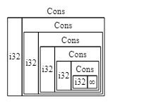
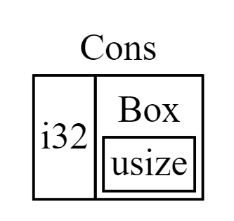

# 스마트 포인터
포인터처럼 작동 + 메타데이터를 기반으로 추가적인 능력을 가진 포인터.

C++의 shared_ptr, unique_ptr 등 다른 언어에도 존재하는 개념

참조자와는 달리, 스마트 포인터는 보통 데이터를 소유하고 있다. 러스트 공식문서 에서는 `Vec<T>`, `String` 같은 타입도 메모리를 소유하고 다룰 수 있게 해준다는 측면에서 스마트 포인터의 일종이라고 설명한다.

일반적으로 구조체를 기반으로 구현되며, 몇몇 trait을 구현한다.
- `Deref`: 인스턴스가 참조자처럼 동작하도록 만들어, 참조자·스마트 포인터와 함께 작동하는 코드를 작성할 수 있게 한다.
- `Drop`: 스마트 포인터 인스턴스가 스코프 바깥으로 벗어날 때 실행되는 코드를 커스터마이징할 수 있게 한다.

자주 사용하는 스마트 포인터 종류들...
- `Box<T>`: 값을 힙에 할당
- `RC<T>`: 복수 소유권을 가능하게. 참조 **카운팅**
- `Ref<T>`, `RefMut<T>`:  대여 규칙을 런타임에 강제, `RefCell<T>`로 접근 가능

# Box&lt;T&gt;
힙에 데이터를 저장할 수 있게 만들어주는 스마트 포인터.

힙에 데이터를 담는 것 이외의 특별한 기능이 없어 성능적 오버헤드가 없다.

1. 컴파일 타임에 크기를 알 수 없는 타입을 정확한 크기를 요구하는 컨텍스트 내에서 사용하고 싶음 => Box 기반 재귀적 타입
2. 커다란 데이터의 소유권을 옮길 때 데이터가 복사되지 않음을 보장하고 싶음 => 실제 데이터는 힙에 존재, 힙을 가리키는 포인터 데이터만 스택에서 복사
3. 특정 트레잇을 구현했다는 사실만 알고 값을 사용하고 싶음 => 트레잇 객체

```rust
let b = Box::new(5);
println!("b = {b}");
```
`Box::new`의 파라미터에 힙에 저장하고 싶은 데이터를 담아 생성. 박스가 스코프를 벗어나면, 연관된 힙 상의 데이터도 함께 해제됨.

## 재귀적 타입
자신 안에 자신과 동일한 타입의 값을 담을 수 있는 타입. 

linked list의 각 노드를 일종의 재귀적 타입으로 볼 수 있다.

```rust
// Cons는 재귀적인 배리언트. 컴파일 타임에 List2의 크기를 고정할 수 없음.
pub enum List {
  Cons(i32, List),
  Nil,
}
```
List 열거형의 크기를 계산할 때 Cons 배리언트가 List 열거형 자신을 재귀적으로 포함하고 있으므로, List에게 할당될 메모리 크기는 무한히 증가한다.



따라서 직접적으로 List 자신을 포함하는 대신, 크기가 확정되어 있는 포인터가 List를 가리키는 방식으로 처리하면 컴파일 타임에 메모리 크기를 확정할 수 있다. 




따라서 Cons에 포함한 List를 Box를 이용하여 감싼다.
```rust
pub enum List {
  Cons(i32, Box<List>),
  Nil,
}
```
